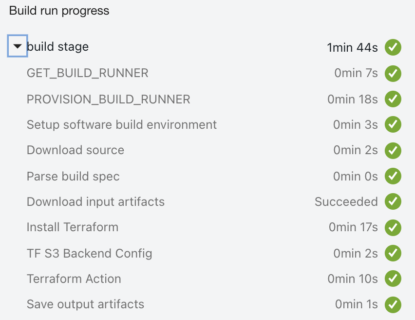

Sample illustration of invoking terraform from OCI Managed Build stage.
------------
🎌 Flow 

- Use OCI managed build pipeline.
- Use OCI S3 as a backed for terraform.
- USe OCI Vault for storing sensitive informations (for backend store).
- Use OCI terraform provider for OCI infra management.


✅ Usage

- Create an object storage bucket.
- Clone the repo to your local laptop.

```
$ git clone https://github.com/RahulMR42/OCI-BuildRunner-With-Terraform-with-S3State
```

- Declare the below variables to OCI vault as secrets

```
aws_access_key_id
aws_secret_access_key
tenancy_ocid
compartment_ocid
```

- Fill the correct OCID values of secrets in toe build_spec.yaml.
- Update variables.tf according to the OCI region selected.
- Create a build pipeline and create a manage build 
- Its a sample execution with a test dynamic  group.

Output references
-----
- Build stage steps.



- Sate file refernces (via OCI Object Storage)


🗨️ References

- OCI Devops  - https://docs.oracle.com/en-us/iaas/Content/devops/using/home.htm

- OCI Terraform references - https://registry.terraform.io/providers/hashicorp/oci/latest/docs

- OCI Terraform with S3 backend - https://docs.oracle.com/en-us/iaas/Content/API/SDKDocs/terraformUsingObjectStore.htm

- OCI Object storage - https://docs.oracle.com/en-us/iaas/Content/Object/home.htm

- OCI Configuring auth for TF provider - https://docs.oracle.com/en-us/iaas/Content/API/SDKDocs/terraformproviderconfiguration.htm#instancePrincipalAuth


Its a Sample execution ,refer OCI documentations for necessary permissions /policies and others details.